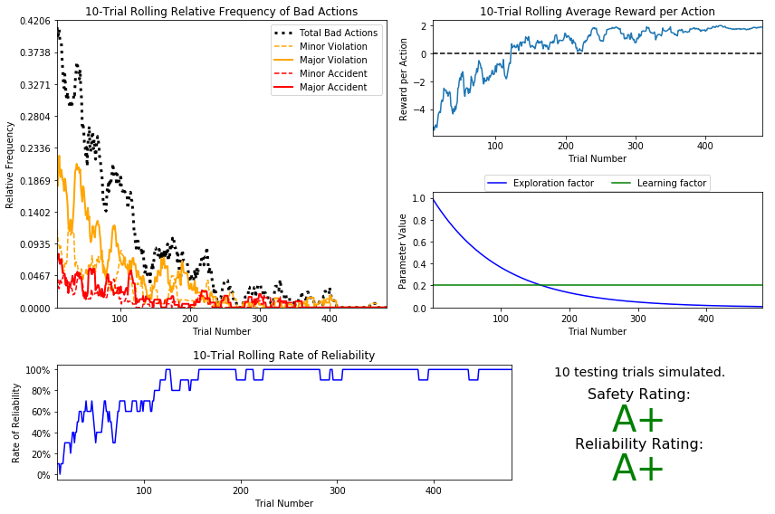

# My First Project in Machine Learning Engineer Nanodegree
# Reinforcement Learning
## Project: Train a Smartcab How to Drive

<p align = 'center'></p>

----

### Table Of Contents:
- [Description](#description)<br>
    - [About the project](#about-the-project)<br>
    - [What needs to be done](#what-needs-to-be-done)<br>
- [Definitions](#definitions)<br>
    - [Environment](#environment)<br>
    - [Inputs and Outputs](#inputs-and-outputs)<br>
    - [Rewards and Goal](#rewards-and-goal)<br>
- [Data](#data)<br>
    - [Files](#files)<br>
- [Loading Project](#loading-project)<br>
    - [Requirements](#requirements)<br>
    - [Execution](#execution)<br>
- [Troubleshooting Pygame](#troubleshooting-pygame)<br>
    - [Fixing Common Pygame Issues](#fixing-common-pygame-issues)<br>
    - [Often Problems Reported](#often-problems-reported)<br>
- [Conclusion](#conclusion)<br>
    - [Evaluation](#evaluation)<br>
    - [Results](#results)

----

### Description

#### About the project

In the not-so-distant future, taxicab companies across the United States no longer employ human drivers to operate their fleet of vehicles. Instead, the taxicabs are operated by self-driving agents, known as *smartcabs*, to transport people from one location to another within the cities those companies operate. In major metropolitan areas, such as Chicago, New York City, and San Francisco, an increasing number of people have come to depend on *smartcabs* to get to where they need to go as safely and reliably as possible. Although *smartcabs* have become the transport of choice, concerns have arose that a self-driving agent might not be as safe or reliable as human drivers, particularly when considering city traffic lights and other vehicles. To alleviate these concerns, my task as an employee for a national taxicab company is to use reinforcement learning techniques to construct a demonstration of a *smartcab* operating in real-time to prove that both safety and reliability can be achieved.

#### What needs to be done

In this project I have applied reinforcement learning techniques for a self-driving agent in a simplified world to aid it in effectively reaching its destinations in the allotted time. I have first investigated the environment the agent operates in by constructing a very basic driving implementation. Once the agent is successful at operating within the environment, I have then identified each possible state the agent can be in when considering such things as traffic lights and oncoming traffic at each intersection. With states identified, I have then implement a Q-Learning algorithm for the self-driving agent to guide the agent towards its destination within the allotted time. Finally, I have improved upon the Q-Learning algorithm to find the best configuration of learning and exploration factors to ensure the self-driving agent is reaching its destinations with consistently positive results.

----

### Definitions

#### Environment

The *smartcab* operates in an ideal, grid-like city (similar to New York City), with roads going in the North-South and East-West directions. Other vehicles will certainly be present on the road, but there will be no pedestrians to be concerned with. At each intersection there is a traffic light that either allows traffic in the North-South direction or the East-West direction. U.S. Right-of-Way rules apply: 
- On a green light, a left turn is permitted if there is no oncoming traffic making a right turn or coming straight through the intersection.
- On a red light, a right turn is permitted if no oncoming traffic is approaching from your left through the intersection.
To understand how to correctly yield to oncoming traffic when turning left, you may refer to [this official drivers' education video](https://www.youtube.com/watch?v=TW0Eq2Q-9Ac), or [this passionate exposition](https://www.youtube.com/watch?v=0EdkxI6NeuA).

#### Inputs and Outputs

Assume that the *smartcab* is assigned a route plan based on the passengers, starting location and destination. The route is split at each intersection into waypoints, and you may assume that the *smartcab*, at any instant, is at some intersection in the world. Therefore, the next waypoint to the destination, assuming the destination has not already been reached, is one intersection away in one direction (North, South, East, or West). The *smartcab* has only an egocentric view of the intersection it is at: It can determine the state of the traffic light for its direction of movement, and whether there is a vehicle at the intersection for each of the oncoming directions. For each action, the *smartcab* may either idle at the intersection, or drive to the next intersection to the left, right, or ahead of it. Finally, each trip has a time to reach the destination which decreases for each action taken (the passengers want to get there quickly).  If the allotted time becomes zero before reaching the destination, the trip has failed.

#### Rewards and Goal

The *smartcab* will receive positive or negative rewards based on the action it as taken. Expectedly, the *smartcab* will receive a small positive reward when making a good action, and a varying amount of negative reward dependent on the severity of the traffic violation it would have committed. Based on the rewards and penalties the *smartcab* receives, the self-driving agent implementation should learn an optimal policy for driving on the city roads while obeying traffic rules, avoiding accidents, and reaching passengers' destinations in the allotted time

----

### Data

#### Files

This project contains 6 files and 4 folders:

- `smartcab.ipynb`: This is the main file where I have performed my work on the project.
- `visuals.py`: This Python script provides supplementary visualizations for the Analysis.
- `/logs/`: This folder will contain all log files that are given from the simulation when specific prerequisites are met.
- `/smartcab/`: This folder contains the Python scripts that create the environment, graphical user interface, the simulation, and the agents. NO not need to modify or create any files in this directory except for `agent.py` file.
    - `/images/`: This folder contains various images of cars to be used in the graphical user interface. You will not need to modify or create any files in this directory.
     - `agent.py`: This is the main Python file where I have performed my work on the project.
     - `environment.py`: This Python file will create the *smartcab* environment. (Do not modify)
     - `planner.py`: This Python file creates a high-level planner for the agent to follow towards a set goal. (Do not modify)
     - `simulation.py`: This Python file creates the simulation and graphical user interface. (Do not modify)
- `export/` : Folder containing HTML file of notebook.   


Template code is provided in the `smartcab/agent.py` python file. Additional supporting python code can be found in `smartcab/enviroment.py`, `smartcab/planner.py`, and `smartcab/simulator.py`. Supporting images for the graphical user interface can be found in the `images` folder. While some code has already been implemented, I have implement additional functionality for the `LearningAgent` class in `agent.py` when requested to successfully complete the project. 

------

### Loading Project

#### Requirements

This project requires **Python 2.7** and the following Python libraries installed:

- [Python 2.7](https://www.python.org/download/releases/2.7/)
- [NumPy](http://www.numpy.org/)
- [pandas](http://pandas.pydata.org/)
- [matplotlib](http://matplotlib.org/)
- [PyGame](http://pygame.org/)

You will also need to have software installed to run and execute a [Jupyter Notebook](http://jupyter.org/install)

If you do not have Python installed yet, it is highly recommended that you install the [Anaconda](https://www.anaconda.com/download/) distribution of Python, which already has the above packages and more included. Make sure that you select the Python 2.7 installer and not the Python 3.x installer. `pygame` can then be installed using one of the following commands:

Mac:  `conda install -c https://conda.anaconda.org/quasiben pygame`  
Windows: `conda install -c https://conda.anaconda.org/CogSci pygame`  
Linux:  `conda install -c https://conda.anaconda.org/tlatorre pygame`  

You can run an example to make sure pygame is working before actually performing the project by running:

```bash
python -m pygame.examples.aliens
```

#### Execution

In a terminal or command window, navigate to the top-level project directory `smartcab/` (that contains this README) and run one of the following commands:

```bash
python smartcab/agent.py
```  
or
```bash
python -m smartcab.agent
```

This will run the `agent.py` file and execute your agent code.

**AND**

```bash
ipython notebook customer_segments.ipynb
```  
or
```bash
jupyter notebook customer_segments.ipynb
```

This will open the Jupyter/iPython Notebook software and project file in your browser.

-----

### Troubleshooting Pygame

#### Fixing Common Pygame Issues
The PyGame library can in some cases require a bit of troubleshooting to work correctly for this project. While the PyGame aspect of the project is not required for a successful submission  (you can complete the project without a visual simulation, although it is more difficult), it is very helpful to have it working! If you encounter an issue with PyGame, first see these helpful links below that are developed by communities of users working with the library:
- [Getting Started](https://www.pygame.org/wiki/GettingStarted)
- [PyGame Information](http://www.pygame.org/wiki/info)
- [Google Group](https://groups.google.com/forum/#!forum/pygame-mirror-on-google-groups)
- [PyGame subreddit](https://www.reddit.com/r/pygame/)

#### Often Problems Reported
_"PyGame won't install on my machine; there was an issue with the installation."_  
**Solution:** As has been recommended for this project, it is suggested that you are using the Anaconda distribution of Python, which can then allow you to install PyGame through the `conda`-specific command.

_"I'm seeing a black screen when running the code; output says that it can't load car images."_  
**Solution:** The code will not operate correctly unless it is run from the top-level directory for `smartcab`. The top-level directory is the one that contains the **README** and the project notebook.

-----

### Conclusion

#### Evaluation

My project was reviewed by a Udacity reviewer against the **<a href="https://review.udacity.com/#!/rubrics/106/view" target="_blank"> Train a Smartcab to Drive project rubric.</a>**. All criteria found in the rubric must be *meeting specifications* for me to pass.

#### Results
[My Project Review by an Udacity Reviewer](https://review.udacity.com/#!/reviews/1311739)

**Result after applying Imporved Q-Learning Algorithm**

<p align = 'center'></p>

----